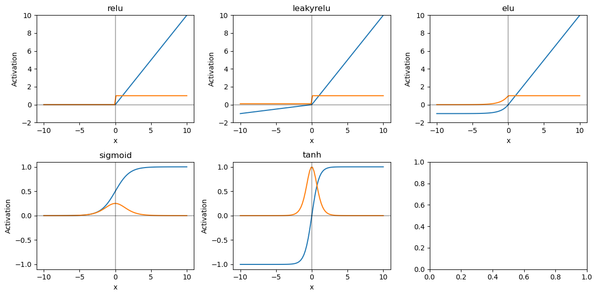

# CS231N Lecture 4

---

## Resources

Slides: https://cs231n.stanford.edu/slides/2025/lecture_4.pdf
 
Direct Video link: 
https://www.youtube.com/watch?v=25zD5qJHYsk&list=PLoROMvodv4rOmsNzYBMe0gJY2XS8AQg16&index=5

[](https://www.youtube.com/watch?v=25zD5qJHYsk)

Supplementary Reading
- [Backprop](https://cs231n.github.io/optimization-2/)
- [Linear Backprop](https://cs231n.stanford.edu/handouts/linear-backprop.pdf)
- More backprop references:
  - [Why Momentum Really Works](https://distill.pub/2017/momentum/)
  - [Derivatives Notes](https://cs231n.stanford.edu/handouts/derivatives.pdf)
  - [Efficient Backprop](https://cseweb.ucsd.edu/classes/wi08/cse253/Handouts/lecun-98b.pdf)
  - More backprop references [[1]](https://colah.github.io/posts/2015-08-Backprop/), [[2]](http://neuralnetworksanddeeplearning.com/chap2.html), [[3]](https://www.youtube.com/watch?v=q0pm3BrIUFo)

---

## TLDR

- Multi-Layer Perceptron
- Backpropagation

---

## Summary

### Multi-Layer Perceptron // aka Fully Connect Networks

We build from a simple linear classifier to a two layer network

- 1-layer Neural Network = original Linear score function:
  - $f = Wx$
    - $x \in \mathbb{R}^D$
    - $W \in \mathbb{R}^{C \times D}$
- 2-layer Neural Network
  - $f = W_2 \max(0,W_1 x)$
    - $x \in \mathbb{R}^D$
    - $W_1 \in \mathbb{R}^{H \times D}$
    - $W_2 \in \mathbb{R}^{C \times H}$
- 3-layer Neural Network
  - $f = W_3 \max (0,W_2 \max(0, W_1 x))$
    - $x \in \mathbb{R}^D$
    - $W_1 \in \mathbb{R}^{H_1 \times D}$
    - $W_2 \in \mathbb{R}^{H_2 \times H_1}$
    - $W_3 \in \mathbb{R}^{C \times H_2}$
- Note on bias terms
  - In practice we add a learnable bias at each layer
  - We can do this explicitly by adding a bias term $(W_i x + b_i)$, or by stacking $x' = [1 \; x]^T$
- Why we do want the non-linearity?
  - Analytically, Without it, we fall back to a single linear transformation
    - $f = W_2 (W_1 x) = (W_2 W_1) x = W x$
      - $W = W_2 W_1$
  - Intuitively, the non-linearity is what allows us to separate classes that are not linearly separable.

#### Activation Functions



The purpose of Activation Functions is to introduce non-linearity.

The $\max(0,\dots)$ operation we saw earlier, is just one example of a non-linearity we could use. These are a few more commonly relied upon non-linearities, otherwise called Activation Functions.

- ReLU: $\boxed{\max(0,x)}$
  - Pro: Simplest
  - Con: Sometimes creates dead neurons, negative terms vanish
- Leaky ReLU: $\boxed{\max(0.1 x,x)}$
  - Pro: Slightly better than ReLU
  - Con: Still has a non-differentiable kink at 0
- ELU: $\text{if } x \geq 0 \text{ then: } \boxed{x} \text{ else: } \boxed{a (e^x-1)}$
  - Pro: zero centered ReLU with no kink
- GELU: $\boxed{x \cdot \phi(x)}$
  - FYI: Used in transformers
- SiLU: $\boxed{x \cdot \sigma(x)}$
  - FYI: Used in modern NN architectures
- Sigmoid: $\boxed{\frac{1}{1 + e^{-x}}}$
  - Con: Squashes values in a narrow range, sometimes leads to vanishing gradients, so we avoid in in-between layers of a NN, but prefer it in the last layer to lead to binary outcomes or a multi-class selection
- Tanh: $\boxed{\frac{e^x - e^{-x}}{e^x + e^{-x}}}$
  - Con: Squashes values in a narrow range, sometimes leads to vanishing gradients, so we avoid in in-between layers of a NN, but prefer it in the last layer to lead to binary outcomes or a multi-class selection

#### Network architecture

- Choose activation functions
  - Choice of activation functions is typically empirical
  - Some rules of thumb
    - For intermediate layers
      - Generally, ReLU and similar activation functions serve well here, not Sigmoid or Tanh
      - It is common to use the same activation function (ReLU, or GeLU, etc) across all intermediate layers
  - For the final layer
    - Generally, Sigmoid amd tanh serve well in the final layer
      - This is because these functions tend to squish the output in a narrow range - this is bad for gradient calculations (vanishing gradients), but good for the final layer where we might want a binary output or a multiclass selection

- Choose size of network
  - More neurons and/or layers = more capacity
  - Choice of network size is empirical - explore other similar problems, or just trial and error
  - Caution: Do not use size of neural network as a regularizer, instead use stronger regularizer (i.e. the $\lambda$ factor in $L = \frac{1}{N}\sum L_i + \lambda R(W)$) instead.
    - Large networks, take longer to train because they have more parameters, and tend to overfit
    - So we start with a small network and scale up
  


Example: Feed-forward computation of a 3-layer neural network

```python
# forward-pass of a 3-layer neural network:
f = lambda x: 1.0/(1.0 + np.exp(-x)) # activation function (use sigmoid)
x = np.random.randn(3, 1) # random input vector of three numbers (3x1)
h1 = f(np.dot(W1, x) + b1) # calculate first hidden layer activations (4x1)
h2 = f(np.dot(W2, h1) + b2) # calculate second hidden layer activations (4x1)
out = np.dot(W3, h2) + b3 # output neuron (1x1)
```

Example: Full implementation of training a 2-layer Neural Network in ~20 lines:

```python
import numpy as np
from numpy.random import randn

# Define the network
N, D_in, H, D_out = 64, 1000, 100, 10
x, y = randn(N, D_in), randn(N, D_out)
w1, w2 = randn(D_in, H), randn(H, D_out)

# Forward pass
for t in range(2000):
    h = 1 / (1 + np.exp(-x.dot(w1)))
    y_pred = h.dot(w2)
    loss = np.square(y_pred - y).sum()
    print(t, loss)

    # Calculate analytical gradients
    grad_y_pred = 2.0 * (y_pred - y)
    grad_w2 = h.T.dot(grad_y_pred)
    grad_h = grad_y_pred.dot(w2.T)
    grad_w1 = x.T.dot(grad_h * h * (1 - h))

    # Gradient descent
    w1 -= 1e-4 * grad_w1
    w2 -= 1e-4 * grad_w2
```

**Word of caution on brain analogies of Neural Networks**: While there are some useful brain analogies utilized in designing and describing neural networks, these analogies should only be used as inspiration and a big approximation, but not to be taken literally. 

---

### Backpropagation

Intuition:

- Problem:
  - Deriving $\nabla_W L$ on paper each time we design or update a neural network, can be very tedious: lots of matrix calculus, prone to human error.
  - If we want to (1) try a different loss function, or (2) change an activation function, we need to re-derive the gradient
  - This derivation becomes infeasible to do manually for very complex models
- Intuition:
  - What if we programmatically calculate the gradient for any configuration of our neural network?
- Solution:
  - Let's arrange all the operations of a neural network in a computational graph
    - Say we arrange the graph left-to-right, from inputs-to-outputs. Each node is an atomic computational step.
    - First, we do a forward pass, traversing the graph left-to-right, to compute the outputs.
    - Second, we do a backward pass, programmatically deriving the gradient by applying the chain rule at each graph node, and working backward to find the gradient with respect to all variables in the network.
  - Why this works?
    - Breaking down a computational graph into atomic computations allows us to modularize and leverage object oriented programming for each node. 
    - Individual Nodes look like $q=x+y$ or $p=q \cdot x$
    - Computing the output value of a node is straightforward
    - Computing the gradient for a single node's output with respect to its inputs, can be done programmatically for the type of computation the node performs, by defining a few standard nodes ahead of time.
      - We do this by carrying an **upstream gradient**, computing **local gradients** depending on the type of computation in a given node, and generating **downstream gradients** using the chain rule.
    - Stacking these nodes together and working through the gradients with the chain rule, allows us to **backpropagate** gradients to our desired parameters.

#### Computation Patterns

- **Add gate**: gradient distributor
  - $z=x+y$
  - Upstream gradient: $\partial L / \partial z$ = u
  - Local gradients
    - $\partial z / \partial x = 1$
    - $\partial z / \partial y = 1$
  - Downstream gradients
    - $\partial L / \partial x = (\partial L / \partial z) (\partial z / \partial x) = u \cdot 1$
    - $\partial L / \partial y = (\partial L / \partial z) (\partial z / \partial y) = u \cdot 1$
- **Mul gate**: swap multiplier
  - $z=x \cdot y$
  - Upstream gradient: $\partial L / \partial z$ = u
  - Local gradients
    - $\partial z / \partial x = y$
    - $\partial z / \partial y = x$
  - Downstream gradients
    - $\partial L / \partial x = (\partial L / \partial z) (\partial z / \partial x) = u \cdot y$
    - $\partial L / \partial y = (\partial L / \partial z) (\partial z / \partial y) = u \cdot x$
- **Copy gate**: gradient adder
  - $z_1=x$
  - $z_2=x$
  - Upstream gradients: 
    - $\partial L / \partial z_1 = u_1$
    - $\partial L / \partial z_2 = u_2$
  - Local gradients
    - $\partial z_1 / \partial x = 1$
    - $\partial z_2 / \partial x = 1$
  - Downstream gradients
    - $\partial L / \partial x = (\partial L / \partial z_1) (\partial z_1 / \partial x) + (\partial L / \partial z_2) (\partial z_2 / \partial x) = (u_1 + u_2)$
- **Max gate**: gradient router
  - $z=\max(x,y)$
  - Upstream gradients: 
    - $\partial L / \partial z = u$
  - Local gradients
    - $\partial z / \partial x = 1 \text{ if } x > y \text{ else } 0$
    - $\partial z / \partial y = 0 \text{ if } x > y \text{ else } 1$
    - **TODO** how do we handle $x==y$?
  - Downstream gradients
    - $\partial L / \partial x = (\partial L / \partial z) (\partial z / \partial x) = u \text{ if } x > y \text{ else } 0$
    - $\partial L / \partial y = (\partial L / \partial z) (\partial z / \partial y) = 0 \text{ if } x > y \text{ else } u$

#### Vector Backprop

- Scalar to Scalar
  - Inputs
    - $x \in \mathbb{R}, y \in \mathbb{R}$
  - Regular Scalar derivatives
    - $\partial y / \partial x \in \mathbb{R}$
- Vector to Scalar
  - Inputs
    - $x \in \mathbb{R}^N, y \in \mathbb{R}$
  - Vector Gradients
    - $\partial y / \partial x \in \mathbb{R}^N$, $\left( \partial y / \partial x \right)_n = \partial y / \partial x_n$
- Vector to Vector
  - Inputs
    - $x \in \mathbb{R}^N, y \in \mathbb{R}^N$
  - Jacobians
    - $\partial y / \partial x \in \mathbb{R}^(N \times M)$, $\left( \partial y / \partial x \right)_{n,m} = \partial y_m / \partial x_n$
  
