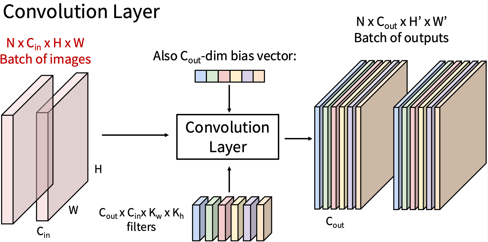

# CS231N Lecture 5

---

## Resources

Slides: https://cs231n.stanford.edu/slides/2025/lecture_5.pdf
 
Direct Video link: 
https://www.youtube.com/watch?v=f3g1zGdxptI&list=PLoROMvodv4rOmsNzYBMe0gJY2XS8AQg16&index=5

Supplementary Reading
- [Convolutional Networks](https://cs231n.github.io/convolutional-networks/)

---

## TLDR

- History
- Higher-level representations, image features
- Convolution and pooling

---

## Summary

### Historical perspective on shifting focus from design of Feature Extractors to design of Neural network architectures

- Historically, Computer Vision relied on designing **feature representations** or **feature extractors**, and then training a linear classifier on top. 
  - The paradigm was, to combine a number of well engineered Feature extractors. Some examples:
    - **Color histogram**: color distribution of how much of each color is in the image
    - **Oriented Gradients**: divide image into 8x8 pixel regions. Within each region, quantize edge direction into 9 bins. 
    - **Bag or Words**: Extract random patches, cluster patches to form codebook of visual words, encode images.
  - Humans designed feature extractors, Gradient descent used to train simple classifiers on top of feature representations.
  - These approaches were dominant in 2000-2010s, but have since been deprecated with the use of Neural Networks.
- More modern approaches drop these feature extractors. 
  - The intuition is, that there might be bottlenecks in feature extraction, the human designer might miss something or something might be too complex to extract as a feature. The paradigm shift is in believing that an end-to-end deep-learned Neural Network can solve this problem better with more data. This paradigm has won over repeatedly in the last 10-15 years.
  - We did gradient descent before too, so what's changed really?
    - [Previous] Humans designed feature extractors, ran gradient descent on simpler classifier architectures
    - [Now] No more designing of feature extractors, instead we design a more complex neural network architecture that uses gradient descent over data to produce a better classifier.
      - Role of human designer still matters in designing the architecture, the length, depth of the network, etc. What the human is designing is now different.

Specific developments

- [1998: LeCun et al's paper](http://yann.lecun.com/exdb/publis/pdf/lecun-01a.pdf). They showed OCR to recognize digits. This was used by USPS. An image from this is popularly referenced in a lot of deep learning material. The underlying architecture used Convolutions and Subsampling. Many of these ideas are still being used today.
- [2012: AlexNet](https://en.wikipedia.org/wiki/AlexNet). This paper caused a big boom in deep learning, by achieving breakthroughs in ImageNet classification.
- 2012-2020-ish: ConvNets dominate all vision tasks, including
  - Detection
  - Segmentation
  - Image Captioning
  - Text to Image generation (refer: [2021 Stable Diffusion paper](https://en.wikipedia.org/wiki/Stable_Diffusion)) 
- 2021-Present: Transformers have taken over
  - 2017: Transformers for language tasks (paper ["Attention is all you need" by Vaswani et al, NeurIPS 2017](https://arxiv.org/abs/1706.03762))
  - 2021: Transformers for vision tasks (paper ["An Image is Worth 16x16 Words: Transformers for Image Recognition at Scale" by Dosovitskiy et al, ICLR 2021](https://arxiv.org/abs/2010.11929))

---

### Convolutional Networks

So far, we've build up a Neural Network using these ideas
1. **Fully Connected Layers**: to create linear layers of weights and features to generate classification scores
2. **Activation functions**: to introduce non-linearities between layers
3. **Computational Graphs**: to represent computations
4. **Backpropagation**: to compute Gradients and run optimization

We introduce two building blocks of ConvNets that have been workhorses for many years:
1. Convolution Layer
2. Pooling Layer

These will eventually get replaced by Transformers, but its useful to understand ConvNets to appreciate how Computer Vision techniques have evolved and develop intuition for applying Deep Learning ideas to images.

### Convolution Layers

What PROBLEM are we solving with Convolutional Networks?
1. Spatial context
   - The FCN or MLP we considered in Lecture 4, flattened all our images (32 x 32 x 3 -> 3072 x 1). 
   - But images are 2 dimensional. Linearizing means **any spatial structure of images is destroyed!**
   - **How might we retain some of this spatial structure?** 
   - What other designs or primitives could be introduced in our computational graph that better respect spatial structure in images?
2. Learning several feature extractors without hand-engineering or hand-selection
   - We saw in historical approaches that a lot of effort was spent in hand-engineering or hand-selecting feature extractors, and then applying a small FCN or MLP on top.
   - We now prefer to have these extractors also be "learned" instead of being hand-picked.

Intuitions
1. What design might be construct to better maintain spatial structure of our images? Could we prioritize pixel neighbors differently and not just flatten an image? When looking at one pixel, could we look at its neighbours together to examine a $3 \times 3$ or $5 \times 5$ block?
2. We previously learned "templates". For example in CIFAR, we learned 10 templates, one for each class, and the size of the "template" was the size of the image. ie. our weight matrix $W$ was $10 \times 3072$. And our output score was based on a template match of the input with each of the templates we had learned.

How about we use different sized templates, where each template becomes a **feature extractor** of sorts, and we run this template over the data image in a 2d by 2d template matching in say $3 \times 3$ or $5 \times 5$ blocks, or **convolution**, to see if we can detect a feature in that $k \times k$ region?

Notes
- In CV, we call each of these templates a **filter**, or **kernel**, and doing this template match over all the different parts of the data image, i.e. sliding our filter around the data image, is called a **convolution**.
- We actually do a 3d by 3d matching, where the 3rd dimension in the input might be RGB colors. and the 3rd dimension in the filter should match the input's third dimension for matrix compatibility.

Solution
- Given an input data image of $3 \times 32 \times 32$
- We learn **filters**, where 
  - Each filter is, say $3 \times 5 \times 5$
  - We might invoke multiple filters at a time. Let's say we invoke $6$ filters. Our **convolution** layer is now $6 \times 3 \times 5 \times 5$ 
- Output
  - For each individual filter ($3 \times 5 \times 5$), we get responses for each individual application of the filter. We can arrange these in a 2d plane. We call this a **response plane**. It has the size $1 \times 28 \times 28$. 
    - The drop from $(3 \times 32 \times 32)$ to $(1 \times 28 \times 28)$ is expected, because of the tensor dot product, or convolution. 
    - The 3 RGB channels and the 3 layers of the filter collapse into 1.
    - The $H$ and $W$ drop by 4 because a filter of $5 \times 5$ will cause shrinkage by $5-1=4$ in $H$ and $5-1=4$ in $W$
  - Since we invoked 6 filters, we now have 6 response planes. If we stack these planes, the output of one convolution is $6 \times 28 \times 28$. We could invoke any number of filters that we choose to learn.
  - Bias vector
    - We include 1 bias scalar for each filter. In the case above, we expect a 6-dim bias vector.
  

**Some challenges in Convolutions**

- **What do filters or kernels learn?** Think of each filter or kernel becoming a **feature extractor**
- **How do filters learn different features?** This occurs via random initialization. If all our filters were initialized the same, they would learn the same outcomes. Instead we choose random initialization, so each kernel starts out at a different point and specializes to learn different features.
- **Linearities**: Stacking CNNs can be reduced to a single CNN because these are linear operations. So we introduce intermediate non-linearities between convolution layers.
- **Images shrink as we apply convolutions**: So we add **padding**, typically 0 padding at the edges of images. Doing this allows us to retain image size through our network.
  - Common setting: $P = (K-1)/2$
  - Output dimension: $W' = W - K_W + 2P + 1$
- **How do deeper layers visualize larger structures?** At each convolution layer we can look around, say a radius of $5 \times 5$, i.e. the kernel size. As images get larger, we need to connect things in one corner of an image to another corner. We do this by introducing the idea of **Receptive fields** with deeper layers
  1. We can either stack several convolution layers. For example, two consecutive layers of $5 \times 5$ can see an area $(2 + 5 + 2 = ) 9$ pixels wide and high. We say the effective receptive field here is $9 \times 9$. This field grows as we add more convolution layers.
  2. OR more efficiently we can use smaller filters with a **Stride**, i.e. we convolve a $3 \times 3$ kernel with a $5 \times 5$ region in our image, where for every 1 pixel in the kernel, we move 2 pixels in the image, giving us a larger receptive field on a small filter
     - Output dimension: $W' = (W - K_W + 2P)/S + 1$
     - Strides downsample layers by a factor of 2. This way effective receptive fields double for each consecutive layer, and we can exponentially grow the effective receptive field as needed - i.e. the human designer of the NN can chose an NN architecture appropriately.

**Convolution Summary**

Summary:

- Input: $C_{in} \times H \times W$
- Hyperparameters:
  - Kernel Size: $K_H \times K_W$
  - Number of filters: $C_{out}$
  - Padding: $P$
  - Stride: $S$

- Weight matrix: $C_{out} \times C_{in} \times K_H \times K_W$
  - gives $C_{out}$ filters of size $C_{in} \times K_H \times K_W$

- Bias Vector: $C_{out}$

- Output size: $C_{out} \times H' \times W'$ where:
  - $H' = (H-K+2P)/S+1$
  - $W' = (W-K+2P)/S+1$

Common settings:
- $K_H = K_W$
- $P=(K-1)/2$
- $C_{in},C_{out} = 32,64,128,256$ (powers of $2$)
- ($1 \times 1$ conv): $K=1, P=0, S=1$ 
- ($3 \times 3$ conv): $K=3, P=1, S=1$
- ($5 \times 5$ conv): $K=5, P=2, S=1$ 
- ($3 \times 3$ conv): $K=3, P=1, S=2$ (downsample by 2)

Other forms of Convolutions
- Groups (used sometimes), Dilations (not as common)
- 1D or 3D convolution: depends on input data

### Pooling Layers

Pooling Layers are another way to downsample within our network. We saw we could do this earlier with Strides, but Convolutions are expensive in compute (FLOPS). Here, Pooling is an inexpensive method to achieve downsampling and built up receptive fields.

Idea
- Take 3 dimensional tensor: $64 \times 224 \times 224$
- Downsample each of the 64 planes independently, then restack them back
- Output: $64 \times 112 \times 112$

Common Downsampling, aka Pooling functions
- Max Pooling $2 \times 2$
  - Kernel size $2 \times 2$, stride $2$
  - takes the maximum of a $2 \times 2$ square
- Average
- Antialias

Discussion
- Typically we don't need Padding in Pooling layers
- All images are typically the same size for both CNNs and Pooling. We might pad images, change aspect ratios, etc. But our training set should generally be images of the same size and aspect ratios to train on meaningfully.

**Pooling Summary**:

Summary:

- Input: $C \times H \times W$

- Hyperparameters:
  - Kernel size: $K$
  - Stride: $S$
  - Pooling function: `max`, `avg`, etc
- Output size: $C \times H' \times W'$
  - $H' = (H-K)/S + 1$
  - $W' = (W-K)/S + 1$

Common settings:

- `max`, $K=2, S=2 \implies$ Gives $2 \times$ downsampling

## Translation Equivariance

If we move (translate) images around, and then run convolution, or vice versa, we expect the same outcomes. We don't do this in practice, but we note this property, specifically a **commutative property** between translation and convolution. This property allows us to intuit and generalize training from one dataset to applying learnings to unseen images, using convolutions.